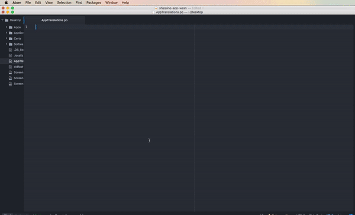
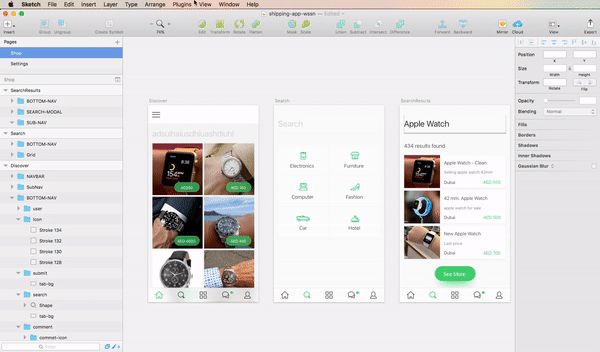
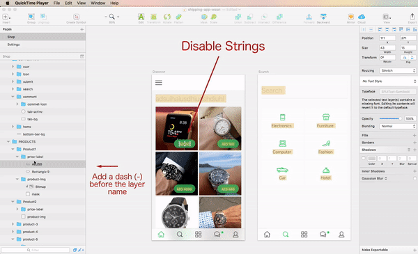

# LingoTool

LingoTool Exporter takes all the strings from Sketch and exports them to a choosen file format. It can be used to **create**, **update** and **remove** strings in files and **creates keys** based of the heirachy of the layers. It also packages up images of the screens that can be used as a reference.



## Requirements
 - Sketch >= 3.4 (not with the sandboxed version ie from the App Store).

## Installing Plugins

[Download the ZIP file](https://github.com/BenAllenUK/LingoTool-Exporter/archive/develop.zip) and unzip
LingoTool-Exporter.sketchplugin

## Supported Exports

|     Format     | Supported |  Date |
| -------------- |:---------:| ----- |
| .po            | ✅        | 1/2/17|
| .xml (Andoird) | ❌        | TBD   |
| .strings (iOS) | ❌        | TBD   |
| Excel          | ❌        | TBD   |
| Plain text     | ❌        | TBD   |
| JSON           | ❌        | TBD   |
| CSV            | ❌        | TBD   |
| XLIFF          | ❌        | TBD   |
| GNU Gettext    | ❌        | TBD   |

## Contributors

- Author [@Ben_Allen](benallen.info)

## Want to contribute?

Anyone can help make this project better - just make a pull request!

## Documentation

### 1. Exporting to PO file
Use the menu option `Export all strings` (Plugins > LingoTool > Export all strings) or `Control` + `Shift` + `I` to export directly to a **.po** file. **Currently This file will appear in your desktop as `AppTranslations.po`**. In the same directory, a folder will contain screenshots of each screen which can be used as context.


### 2. Previewing Changes
Use the menu option `Preview all strings` (Plugins > LingoTool > Preview all strings) or `Control` + `Shift` + `U` to preview which strings will be exported. This will allow you to check visually prior to exporting.


### 3. Ignoring Strings
Prefix a layer name with a dash `-` to avoid exporting it. They will also not appear in preview mode.


## How it works

### How keys are genereated
Keys are generated by first grabbing the *Pagename*, followed by your choosen seperator, then the *Artboard name*, then all the folder names seperated and finally the text layer name.

For example:
`Pagename_ArtboardName_FolderName_SubFolderName_LayerName`
or
`Account_SignIn_Profile_Title`

### How translations files are exported
Each artboard is prefixed with an autogenerated header such as:

```
#: < -- BB3D6A9A-D54A-45E3-BBE6-253735F65BB2 {
#:   -- Artboard name: Shop 
#:   -- Page name: Discover 
#:   -- Updated at: Wed Feb 01 2017 13:13:50 GMT+0000 (GMT)#:   -- Generated by SketchLingo
```

and suffixed with: 

```
#: } BB3D6A9A-D54A-45E3-BBE6-253735F65BB2 -- >
```

These are used as markers when updating string files. These files can be updated from any sketch program by any user so long as its from the same file.

